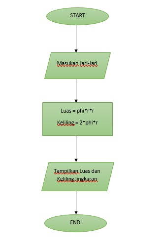
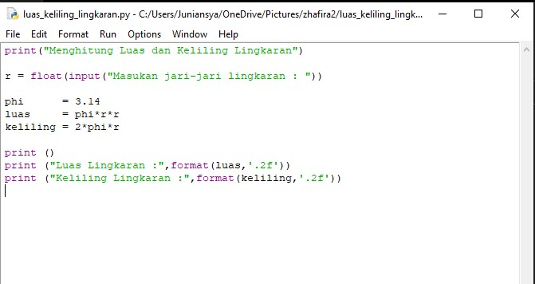
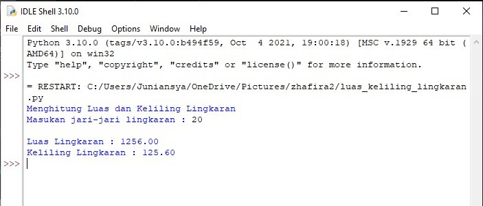

# Menghitung_Luas_Dan_Keliling_Lingkaran
### Rumus
```bash
Luas     = π × r²
Keliling = 2 x π × r
```
- Nilai Phi yang akan kita gunakan adalah 3.14
- r merupakan jari-jari lingkaran

<P>Phi adalah rasio keliling lingkaran dengan diameternya. Phi dilambangkan dengan 'π'. Nilai phi adalah panjang keliling lingkaran yang diameternya 1 satuan. Kita dapat menggunakan π = 3.14 atau π = 22/7.</P>

### Flowchart


### Program



### Penjelasan
<p>Selanjutnya kita memerlukan nilai jari-jari (r) yang nantinya akan di masukan oleh pengguna pada layar console. Kita menggunakan fungsi input() yang nilainya di konversi ke tipe data float (bilangan riil). Ingat bahwa fungsi input() akan menganggap semua nilai inputan bertipe string, sehingga kita perlu melakukan konversi ke tipe yang diinginkan.

Ketika kita sudah mendapat nilai phi dan jari-jari selanjutnya kita bisa menghitung luas dan keliling sesuai dengan rumus-nya

Selanjutnya kita tampilkan hasilnya dengan fungsi print(). sintak \t merupakan karakter espace yang berfungsi untuk membuat tab. dalam kasus ini agar sejajar karakter sama dengan (=) nya.

Jika dilihat hasil luas dan keliling lingkaran mempunyai angka pecahan yang cukup banyak, untuk mengambil 2 angka pecahan saja kita pakai fungsi format() seperti gambar di atas</p>

### Output


## Terima kasih